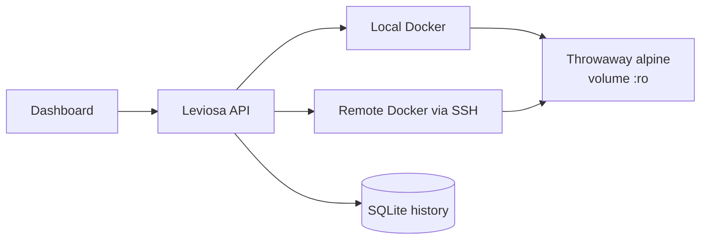
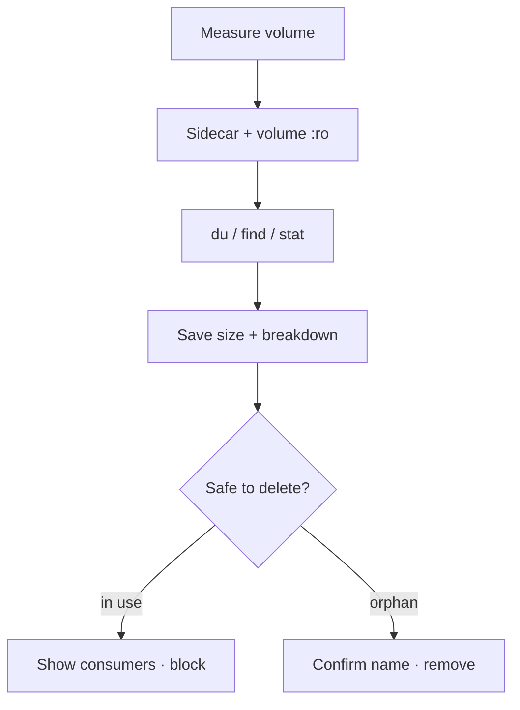

# Leviosa — Docker volume insight

`docker volume ls` tells you a volume exists. It will not tell you how big it is, what is
inside it, which containers depend on it, or whether deleting it is safe.

**Leviosa** does — on this machine and on remote daemons over SSH.

---

## Why I built it

Docker is great at running containers. It is terrible at explaining *storage debt*.

- Size lives behind a root-owned path (or inside a VM on Desktop) — `du` on the host fails.
- “Last used” does not exist in the Engine API. Tools that invent it are lying.
- “Is this volume safe to delete?” means inspecting every container by hand.

I wanted one local screen that answers those questions with evidence, not guesses — without
shipping my Docker socket to the cloud.

---

## Benefits

| Instead of… | Leviosa gives you… |
| ----------- | ------------------ |
| Blind `docker volume ls` | Size, tree breakdown, growth over time |
| Manual `inspect` sprawl | Which containers mount what, live or exited |
| Hoping delete is safe | A verdict that blocks unsafe removes |
| Only “this laptop” | Same view for a VPS via SSH (key path only — no passwords stored) |

Local-first. API on `127.0.0.1`. No account.

---

## How it works



1. **Discover** — list named volumes on the selected host.
2. **Measure** — run a short-lived, locked-down sidecar with the volume mounted read-only
   (`du` / `find` / `stat`). Works where host `du` cannot: Desktop, rootless, remotes.
3. **Map** — attach containers to volumes from the Engine inventory.
4. **Guard** — refuse delete when something still mounts the volume; require an explicit
   name confirmation when it is safe.
5. **Remember** — SQLite stores sizes and a sighting ledger so idle time is honest
   (“tracked since you installed this”), not invented.



**SSH hosts:** only label, address, user, and key *path* (or agent) are saved — never the
private key. New host keys must be confirmed (TOFU), not silently trusted.

---

## Quick start

**Needs:** Node.js ≥ 22.13, pnpm, Docker Engine.

```bash
corepack enable
pnpm install
pnpm dev
```

- Dashboard: http://localhost:4200  
- Health: http://127.0.0.1:4300/api/v1/health  

Optional env: copy `backend/.env.example` and `frontend/.env.example`. Defaults work without them.

---

## Stack

pnpm monorepo — `@leviosa/shared` contracts, Express API, Next.js UI. Measurements via
dockerode; remotes via ssh2; history in `node:sqlite`.
