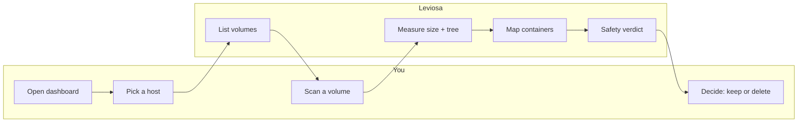
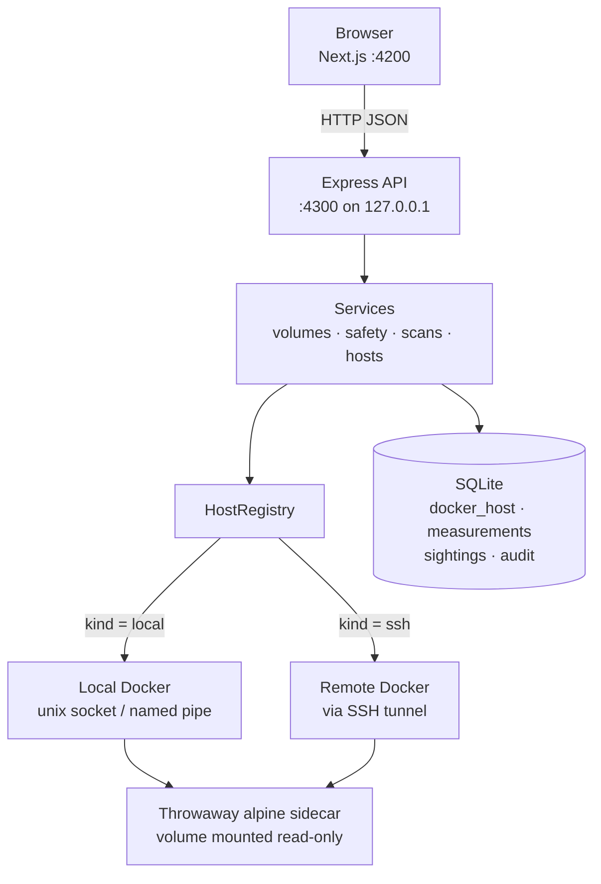
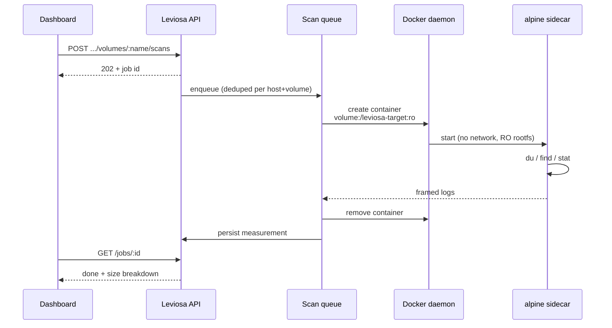
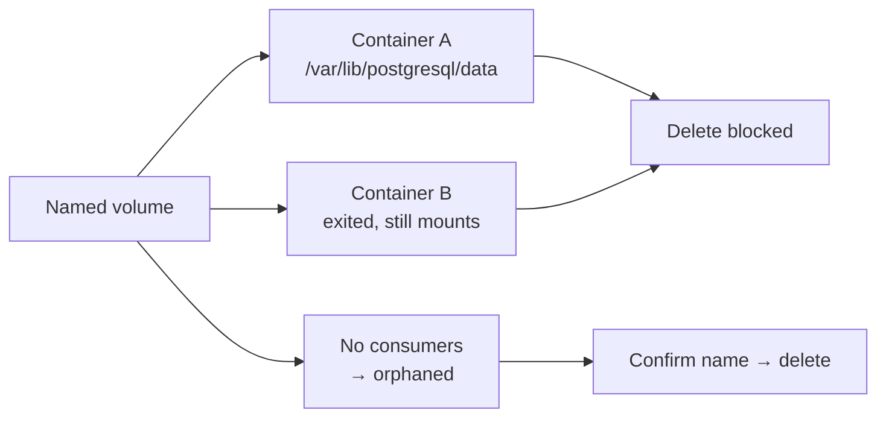
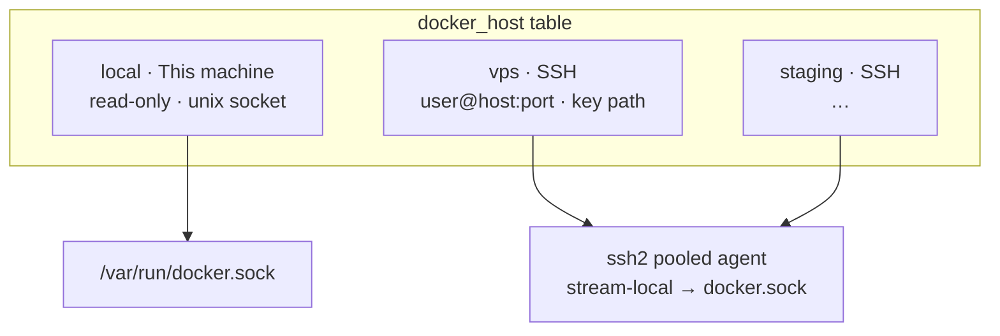
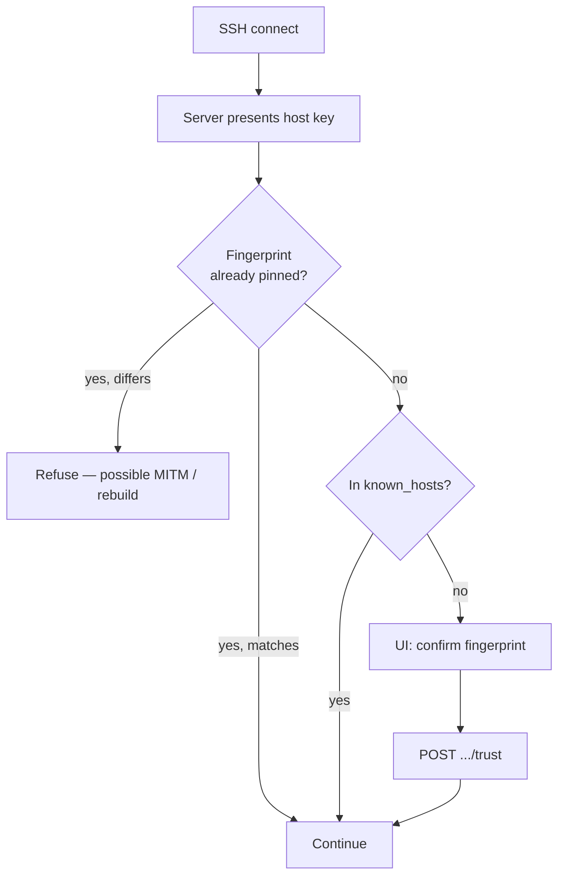
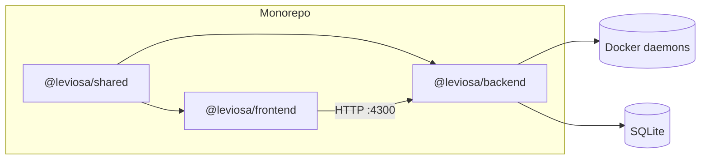
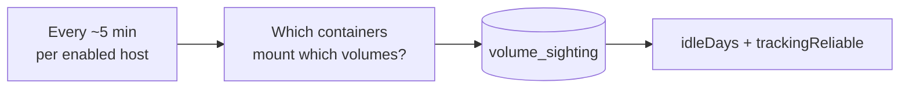

# Leviosa — Docker volume insight

`docker volume ls` tells you a volume exists. It will not tell you how big it is, what is
inside it, which container depends on it, or whether deleting it destroys something you
need. Answering those questions by hand means `docker volume inspect`, then `du` against a
root-owned path, then `docker inspect` across every container, then grepping Compose files.

**Leviosa** answers all four from one screen — on this machine and on remote daemons
reached over SSH:

1. **Discover** every volume on the daemon.
2. **Measure** size and contents, including a per-directory breakdown.
3. **Map dependencies** — which containers mount it, at which path, running or not.
4. **Classify and guard** — detect orphans, and refuse unsafe deletions with a reason.

Local-first. No cloud account. The API binds to `127.0.0.1` by default.

---

## Table of contents

- [What it looks like in practice](#what-it-looks-like-in-practice)
- [How it works](#how-it-works)
- [Multi-host & SSH](#multi-host--ssh)
- [Architecture](#architecture)
- [Two decisions worth understanding](#two-decisions-worth-understanding)
- [Requirements](#requirements)
- [Quick start](#quick-start)
- [Configuration](#configuration)
- [API](#api)
- [Project layout](#project-layout)
- [Conventions](#conventions)
- [Operational notes](#operational-notes)
- [Deliberate limitations](#deliberate-limitations)

---

## What it looks like in practice



Typical loop:

1. Open `http://localhost:4200`
2. Switch host (this machine, or a VPS you registered)
3. Measure the volumes you care about
4. Delete only when the safety panel says it is safe — or leave them alone with evidence

---

## How it works

### End-to-end request path



- The **UI never talks to Docker directly**. It only calls the API.
- The API picks a **host context** (local socket or SSH tunnel), then uses dockerode.
- **Measurements** run inside a short-lived sidecar on the *target* daemon — so remote
  volumes are measured on the remote machine, not copied here.
- **History** (sizes over time, “last seen attached”, audit of deletes) lives in SQLite on
  the machine running Leviosa.

### Measuring a volume (why not plain `du`?)



The sidecar is locked down on purpose: no network, read-only rootfs, almost all
capabilities dropped, memory and PID caps. The volume name is never interpolated into a
shell string — it arrives as an environment variable — so a volume named `; rm -rf /` is
inert data.

When Leviosa can already read the local mountpoint, it may use a faster **host filesystem**
walk instead. Remotes always use the sidecar. `GET /api/v1/health` reports which strategy
each host resolved to, and why.

### Dependency map & safe delete



Deletion passes three gates:

1. `ALLOW_VOLUME_DELETE` (kill-switch for a read-only deployment)
2. `?confirm=<exact-volume-name>`
3. A **fresh** safety check immediately before the Engine call — because inventory can
   change between rendering the page and clicking the button

Blocked attempts are audited with the containers that caused the refusal.

---

## Multi-host & SSH

Leviosa treats each Docker daemon as a first-class host.



### What is stored when you add an SSH host

| Saved in SQLite | Never saved |
| --------------- | ----------- |
| Label, host id | Passwords |
| Hostname / IP, port, SSH user | Passphrases |
| **Path** to a private key (or “use agent”) | Private key material |
| Pinned host-key fingerprint (after you confirm) | Agent secrets |

The database is a local file (`./data/leviosa.sqlite` by default). A tool that can delete
volumes has no business becoming a password store.

### Trust on first use



**Test** runs an end-to-end probe (SSH + Docker `version()`), not a TCP ping. Outcomes:

| Outcome | Meaning |
| ------- | ------- |
| Connected | SSH and Engine answered |
| Host key not confirmed | New or changed key — compare, then trust |
| Authentication rejected | Wrong user/key, or agent unavailable to the API process |
| SSH unreachable | Nothing listening / network blocked |
| Docker unreachable | SSH worked; Engine socket / channel did not |

On a **new laptop**, `pnpm install && pnpm dev` gives you the local host immediately.
Previously registered SSH hosts are **not** copied — that SQLite file stayed on the old
machine. Re-add remotes and ensure the key or agent exists on the new machine.

---

## Architecture

Three workspaces in one **pnpm** monorepo; API and UI stay fully separated:

```
docker-leviosa/
├── shared/     @leviosa/shared    Transport contracts: types, enums, routes, formatters
├── backend/    @leviosa/backend   Express + TypeScript API over Docker (local + SSH)
└── frontend/   @leviosa/frontend  Next.js dashboard
```

`shared` is compiled to `dist/` and consumed by both sides. Route paths, error codes, enum
values and byte/time formatting are declared exactly once, so the client cannot drift from
the server on a URL shape or a status string.



| Surface | Default |
| ------- | ------- |
| Dashboard | http://localhost:4200 |
| API | http://127.0.0.1:4300 |
| Health | http://127.0.0.1:4300/api/v1/health |
| Database | `backend/data/leviosa.sqlite` (when run from `backend/`) |

---

## Two decisions worth understanding

Everything else in this codebase is ordinary. These two are not, and they are the reason
the tool works at all.

### Volumes are measured from inside a container

The obvious implementation is `du -sh /var/lib/docker/volumes/<name>/_data`. It is also the
wrong one. That path is `root:root` mode `0700`, so an ordinary user in the `docker` group
gets `EACCES` — and it does not exist at all on Docker Desktop (the daemon runs inside a
LinuxKit VM), on a rootless daemon, or against a remote host reached over SSH.

So the default strategy starts a throwaway `alpine` container with the volume bind-mounted
**read-only**, runs `du`/`find`/`stat` inside the daemon's own namespace, parses the framed
log stream, and destroys the container. It needs no `sudo`, works on every topology, and
correctly measures payloads owned by foreign uids (a Postgres volume owned by uid 999
behind a `0700` directory measures fine).

The sidecar is locked down: no network, read-only rootfs, `CapDrop: ALL` plus only
`CAP_DAC_READ_SEARCH`, `no-new-privileges`, a memory cap and a pids cap. It runs as root
solely because unprivileged reads would silently under-report size. No caller-supplied
value is ever interpolated into the shell program — the target path arrives through the
environment. The path is then re-resolved with `cd -P` inside the container and re-checked
against the mount root, which defeats a symlink inside the volume pointing at the host
filesystem.

Direct filesystem reads remain available as a fast path (`SCAN_ALLOW_HOST_FS`) on the
**local** host when the process can really read the mountpoint. SSH remotes always use the
sidecar. Both live behind one `ScanStrategy` interface; health reports which one each host
resolved to, and why.

### "Last used 48 days ago" is not a thing Docker knows

The Engine stores no last-used timestamp for a volume. `docker volume inspect` returns a
creation date and a mountpoint, and once the last referencing container is removed, the
daemon retains no evidence the relationship ever existed. Any tool that displays a
confident "last mounted 48 days ago" is inventing it.

Leviosa keeps its own **sighting ledger** instead: a background poll records which
containers are attached to which volumes, in SQLite, **per host**. Idle time is therefore
reported only as far back as this tool has been watching, and every figure carries a
`trackingReliable` flag that stays false until the ledger is older than
`SIGHTING_TRUST_AFTER_DAYS` (default: 7). Day one it says "tracking started recently"
rather than implying a volume has been dead for months.



The same store powers growth history, for the same reason: nothing else records what a
volume weighed yesterday.

---

## Requirements

- **Node.js ≥ 22.13** — `node:sqlite` is the embedded database (no native modules to
  compile). An experimental-feature warning on startup is expected.
- **pnpm 11.x** — this is a pnpm workspace. `npm install` / `yarn` are refused on purpose
  (`scripts/ensure-pnpm.mjs`). Enable via Corepack: `corepack enable`.
- **Docker Engine** reachable on the machine running Leviosa (membership of the `docker`
  group is enough — root is not required).
- **Optional for remotes:** OpenSSH-compatible key on disk, or an agent (`SSH_AUTH_SOCK`)
  visible to the API process; remote user must be able to reach that machine’s Docker socket.

---

## Quick start

```bash
# Node ≥ 22.13, Docker running, pnpm available
corepack enable
pnpm install

# Optional — defaults work without these files
cp backend/.env.example backend/.env
cp frontend/.env.example frontend/.env.local

pnpm dev
```

- Dashboard: <http://localhost:4200>
- API health: <http://127.0.0.1:4300/api/v1/health>

`pnpm dev` builds `@leviosa/shared` once, then starts API and UI in parallel. One side only:

```bash
pnpm --filter @leviosa/backend run dev
pnpm --filter @leviosa/frontend run dev
```

| Command             | Effect                                          |
| ------------------- | ----------------------------------------------- |
| `pnpm dev`          | Shared build + both apps in watch mode          |
| `pnpm build`        | Compile contracts, bundle API, build UI         |
| `pnpm start`        | Run both production builds                      |
| `pnpm typecheck`    | Typecheck all workspaces                        |
| `pnpm clean`        | Remove build output                             |

---

## Configuration

Every variable is optional and documented inline in `backend/.env.example` and
`frontend/.env.example`. `process.env` is read in exactly one file per app
(`backend/src/config/env.config.ts`, `frontend/src/lib/config.ts`), validated with Zod, and
exposed as a frozen object — an unset or malformed variable fails at boot rather than
surfacing as `undefined` three layers deep.

| Variable                         | Default                 | Why you would change it                                      |
| -------------------------------- | ----------------------- | ------------------------------------------------------------ |
| `HOST` / `PORT`                  | `127.0.0.1` / `4300`    | Bind address of the API                                      |
| `DOCKER_HOST`                    | _(unset)_               | Remote or rootless daemon instead of the default socket      |
| `SCAN_TIMEOUT_MS`                | `300000`                | Raise for multi-terabyte volumes                             |
| `SCAN_CONCURRENCY`               | `2`                     | Simultaneous scans; higher values contend for the same disk  |
| `SCAN_WITH_LAST_WRITE`           | `true`                  | Disable to halve scan cost, lose newest-mtime                |
| `SCAN_ALLOW_HOST_FS`             | `true`                  | Local fast path when mountpoints are readable                |
| `SNAPSHOT_ENABLED` / `_CRON`     | `true` / `15 3 * * *`   | Periodic re-measurement — fills growth history               |
| `SIGHTING_INTERVAL_MS`           | `300000`                | How often attachment ledger is refreshed                     |
| `SIGHTING_TRUST_AFTER_DAYS`      | `7`                     | When idle-time figures become `trackingReliable`             |
| `ALLOW_VOLUME_DELETE`            | `true`                  | Set `false` for a strictly read-only API                     |
| `DATABASE_PATH`                  | `./data/leviosa.sqlite` | Where host registry + history live                           |
| `SSH_KNOWN_HOSTS_PATH`           | `~/.ssh/known_hosts`    | Extra TOFU source besides pinned fingerprints                |
| `SSH_AUTH_SOCK`                  | _(from environment)_    | Agent auth when a host has no `keyPath`                      |
| `SSH_CONNECT_TIMEOUT_MS`         | `15000`                 | SSH handshake budget                                         |
| `NEXT_PUBLIC_API_BASE_URL`       | `http://127.0.0.1:4300` | Frontend → API base URL                                      |

---

## API

All responses use one envelope:

```jsonc
{ "success": true,  "data": { }, "meta": { "page": { } } }
{ "success": false, "error": { "code": "VOLUME_IN_USE", "message": "…", "details": { } } }
```

Host-scoped routes (preferred):

| Method   | Route                                         | Purpose                                            |
| -------- | --------------------------------------------- | -------------------------------------------------- |
| `GET`    | `/api/v1/health`                              | Reachability + scan strategy **per host**          |
| `GET`    | `/api/v1/hosts`                               | Host registry                                      |
| `POST`   | `/api/v1/hosts`                               | Register an SSH host                               |
| `GET`    | `/api/v1/hosts/:hostId`                       | Host detail                                        |
| `PATCH`  | `/api/v1/hosts/:hostId`                       | Update label / SSH / enabled                       |
| `DELETE` | `/api/v1/hosts/:hostId`                       | Remove host + its measurements / sightings         |
| `POST`   | `/api/v1/hosts/:hostId/test`                  | End-to-end connection probe                        |
| `POST`   | `/api/v1/hosts/:hostId/trust`                 | Pin a presented host-key fingerprint               |
| `GET`    | `/api/v1/hosts/:hostId/system/summary`        | Counts, measured bytes, reclaimable, queue         |
| `GET`    | `/api/v1/hosts/:hostId/volumes`               | Collection; filters are query params               |
| `GET`    | `/api/v1/hosts/:hostId/volumes/:name`         | Detail: usage, size, breakdown, growth, safety     |
| `GET`    | `/api/v1/hosts/:hostId/volumes/:name/entries` | Depth-one listing (`?path=`)                       |
| `GET`    | `/api/v1/hosts/:hostId/volumes/:name/growth`  | Growth series (`?days=`)                           |
| `POST`   | `/api/v1/hosts/:hostId/volumes/:name/scans`   | Queue a measurement → `202` + job                  |
| `GET`    | `/api/v1/jobs/:id`                            | Poll a queued measurement                          |
| `DELETE` | `/api/v1/hosts/:hostId/volumes/:name`         | Remove volume (`?confirm=<name>`)                  |

Filtering / sorting / pagination stay on the collection endpoint —
`?usage=ORPHANED&sort=size&order=desc` — rather than separate `/orphaned` routes.

Unscoped `/api/v1/volumes…` aliases still resolve to the **local** host for compatibility;
new clients should use the host-nested paths.

---

## Project layout

```
backend/src/
├── config/       Frozen config + every constant (no literals live in services)
├── docker/       Host registry, SSH agent, dockerode contexts, sidecar runner
├── scanner/      Strategy interface, sidecar + host-fs strategies, parser
├── queue/        Bounded-concurrency queue and the scan job registry
├── store/        node:sqlite, host/measurement/sighting/audit repos, migrations
├── services/     Hosts, dependency graph, safety, browse, summaries
├── validations/  Zod schemas at the edge (incl. credential rejection)
├── controllers/  Validate, delegate, envelope
├── routes/       Versioned router built from shared path segments
├── middlewares/  Host scoping, request logging, error serialisation
└── scheduler/    Periodic snapshots and ledger polling (fans out per host)

frontend/src/
├── app/          App Router — /hosts/[hostId]/volumes, /settings, landing
├── components/   ui/, volumes/, detail/, hosts/, layout/
├── hooks/        One React Query hook per concern
└── lib/          API client, endpoints, query keys, config, constants
```

---

## Conventions

These are applied consistently; they are the difference between a codebase you can extend
and one you can only append to.

- **Wrapped modules.** Each module exports one frozen PascalCase object of named methods
  (`VolumeService`, `ScanParser`, `ApiResponse`). Internal helpers are prefixed with `_`
  and never exported.
- **Aggregator per directory.** `index.<dir>.ts` is the import surface; nothing reaches
  across into a sibling's internals.
- **No literals in logic.** Strings, numbers, table names, protocol tokens and enum values
  live in `config/constants.config.ts` or in `@leviosa/shared`.
- **Node built-ins are explicit.** `node:fs`, `node:path`, `node:crypto`, `node:sqlite`.
- **One error type.** Only `ApiError` is serialisable; anything else reaching the error
  middleware is logged in full and reported as `INTERNAL_ERROR` without leaking its
  message.
- **The main thread never blocks.** Measurement is delegated to the daemon and awaited
  through a bounded queue. Worker threads are deliberately absent: this process performs no
  CPU-bound work, so they would add machinery without moving a single cycle off the loop.

---

## Operational notes

- **Scans are asynchronous.** `POST …/scans` returns `202` and a job id. A large volume is
  a full tree walk; an HTTP request is the wrong place to hold that open.
- **Duplicate scans collapse.** Requesting a scan for a host+volume already queued or
  running returns the existing job instead of piling on work.
- **Jobs are in-memory, measurements are durable.** A restart loses progress handles, never
  results. The `JOB_NOT_FOUND` message says so.
- **Stale sizes are shown, not hidden,** and labelled. A six-hour-old figure still answers
  "which of these is the big one?".
- **Unmeasured is not zero.** Volumes never scanned are counted separately so the
  reclaimable total is never quietly understated.
- **Sidecars are labelled and reaped.** Containers are tagged `io.leviosa.owner`; strays
  from a process that died mid-scan are cleaned up at boot.
- **SSH connections are pooled.** The agent keeps a live session and opens a channel per
  Engine HTTP request (stream-local to the remote socket, with dial-stdio fallback).

---

## Deliberate limitations

- **Idle time starts when you install this.** Docker keeps no history to backfill from.
- **Named `local`-driver volumes.** Third-party drivers (NFS, cloud) are listed and
  dependency-mapped, but their contents may not be walkable from a bind mount.
- **Bind mounts and images are out of scope.** Only named volumes. Extending to images and
  build cache is the natural next step; the strategy interface is where it plugs in.
- **Single node, no auth.** This is a developer tool bound to `127.0.0.1` by default. It
  can delete data and has no authentication — do not expose it on a shared network as-is.
- **SSH credentials never leave the machine.** Only host metadata and key *paths* are
  stored. A new laptop must re-register remotes and already have the keys/agent.
- **Unverified host keys are refused.** There is no silent accept — trust is an explicit
  operator action after fingerprint comparison.
- **Filenames containing newlines** produce one unparseable record in a listing, which the
  parser drops. Totals stay correct.

---

## Why the name

`docker volume` data is heavy until you understand it. Leviosa is the bit that makes it
lighter to reason about — still there, still yours, just easier to lift.
